# Active streaming paths — 2026-09-07

Task 00.04: source inspection at revision
`cc7e911` on branch `docs/active-streaming-paths`. The initial working tree was
clean. This map describes the current windowed app; it does not validate a PS5
session or introduce an immersive renderer.

## Connection and ownership

[HomeView.swift](../VisionRemotePS5/Views/HomeView.swift) selects the console,
sets `AppState.isInStreamingSession`, and opens `StreamingWindow`.
[VisionRemotePS5App.swift](../VisionRemotePS5/VisionRemotePS5App.swift) declares
that window and owns the shared `AppState`/`StreamingViewModel`.
[StreamingVideoWindow.swift](../VisionRemotePS5/Views/StreamingVideoWindow.swift)
mounts the Metal view, enables the frame mailbox, and calls the model from its
`.task` when the model is not connected.

[StreamingView.swift](../VisionRemotePS5/Views/StreamingView.swift) contains
`StreamingViewModel.startStreaming(console:auth:)`: it creates the configuration
for 1920×1080, 60 fps, and 15,000 kbps, obtains PSN authentication when needed,
and calls `StreamingService.shared.startStreaming(configuration:)`.

[StreamingService.swift](../VisionRemotePS5/Services/StreamingService.swift)
owns the session's decoder, audio player, controller manager, input gate, and
PSN start task. `startStreamingV2()` constructs these resources and installs
callbacks before choosing a connection path:

- LAN: optional wake/probe, then `ChiakiFullSession.start` →
  `chiaki_fullsession_start_wrapper`.
- PSN: `startPSNStreaming` runs `ChiakiFullSession.startPSN` on a detached task,
  with cancellation and timeout → `chiaki_fullsession_start_psn_wrapper`.

[ChiakiFullSession.swift](../VisionRemotePS5/Services/ChiakiFullSession.swift)
bridges Swift to the project-owned
[ChiakiCore.c](../VisionRemotePS5/Chiaki/ChiakiCore.c). Both connections feed the
same video/audio/event callbacks. The app links the tracked Chiaki archive;
this inspection does not establish that an ignored vendored checkout matches
every implementation detail inside that archive.

The native connected event reaches `eventCallback` → `onEvent` → the service's
main-actor state update. Only that service update enables `inputGate` and marks
the service `.streaming`; successfully returning from a start wrapper alone is
not its input authorization condition.

## Video

```mermaid
flowchart LR
    A[Chiaki session] --> B[session_video_sample_cb]
    B --> C[videoCallback / onVideoFramePointer]
    C --> D[StreamVideoDecoder.submit]
    D --> E[VideoToolbox output]
    E --> F[VideoDelivery.shared mailbox]
    F --> G[MetalTextureView render queue]
    G --> H[Native / MetalFX / Enhanced]
    H --> I[CAMetalDrawable presentation]
```

`session_video_sample_cb` forwards an encoded access unit and loss/recovery
metadata to `videoCallback`. The Swift callback validates active/shutdown state
and forwards synchronously to `onVideoFramePointer`. The service closure captures
the session's decoder, avoiding an actor hop per encoded frame.

`StreamVideoDecoder`, defined in `StreamingService.swift`, copies accepted input
into `Data`, timestamps it with `CACurrentMediaTime()` in microseconds, and
submits to the serial `video.decode` queue. Admission is nonblocking and bounded
to 12 CPU submissions. Returning `false` means input was not queued; that result
propagates to Chiaki. Slots are released after submission work, independently
of asynchronous VideoToolbox output.

`decodeAccessUnit` collects HEVC/H.264 parameter sets, builds a complete sample
from VCL slices, and calls `VTDecompressionSessionDecodeFrame`. Output requests
Metal-compatible BGRA buffers. Generation and decoder epoch checks reject stale
outputs; `ContinuationGate` permits one completion per submission. Stop bumps
generation/epoch and schedules session invalidation. Loss metadata does not
unconditionally erase surviving decoder references.

The decoder completion calls `VideoDelivery.shared.submit` directly.
[UpscalingPipeline.swift](../VisionRemotePS5/Streaming/UpscalingPipeline.swift)
defines **all three** of `VideoFrameMailbox`, `VideoDelivery`, and
`UpscalingPipeline`. The mailbox retains one latest `CVPixelBuffer`, reception
timestamp, and increasing frame ID under a lock. Disabled submissions are
ignored; disabling clears the retained frame. It has no session-generation
field of its own. SwiftUI changes processing settings, not per-frame payloads.

[MetalTextureView.swift](../VisionRemotePS5/Views/MetalTextureView.swift), through
`Coordinator.draw(in:)`, admits at most two in-flight GPU jobs using a
nonblocking semaphore. Work runs on its serial renderer queue: snapshot the
mailbox, skip unchanged frame/settings, acquire a drawable, create a
`CVMetalTexture` view of the decoded buffer, encode processing and the final
quad, then present/commit. The mailbox lock is released before drawable/GPU work.
The command completion retains the input buffer and CV texture until GPU work
ends and releases capacity.

The active drawable format is `.bgra8Unorm` (SDR). Native is the default.
[MetalFXUpscaler.swift](../VisionRemotePS5/Streaming/MetalFXUpscaler.swift) and
[EnhancedUpscaler.swift](../VisionRemotePS5/Streaming/EnhancedUpscaler.swift)
encode into the renderer's command buffer and produce 3840×2160 output. MetalFX
requires a 1920×1080 input here. Serious/critical thermal state or unavailable
processing causes native fallback. These paths do not renegotiate the source.

`addCompletedHandler` reports GPU completion; `addPresentedHandler` separately
checks a valid presentation timestamp. `onFirstFrame` is announced after GPU
completion, not proof of a visually observed frame. Local timing starts at
decoder admission, excluding preceding PS5 capture/encoding and network transit.

## Direct stereo audio

`ChiakiCore.c` configures `ChiakiOpusDecoder` and its audio sink.
`opus_decoder_settings_cb` records the channel count;
`opus_decoder_frame_cb` converts frames-per-channel to total interleaved Int16
sample count before invoking the Swift `audioCallback`.

`audioCallback` validates the sample buffer and copies it to `Data`, then calls
`onAudioSamples`. The service's captured audio player receives
`enqueueSamples` directly, without a UI delegate hop.
[LowLatencyAudioPlayer.swift](../VisionRemotePS5/Streaming/LowLatencyAudioPlayer.swift)
is configured for 48 kHz stereo and a 40 ms recovery target. It writes to
[AudioRingBuffer.swift](../VisionRemotePS5/Streaming/AudioRingBuffer.swift), bounded
to 200 ms with channel-aligned dropping. The AVAudioSourceNode callback reads
with a try-lock, returns silence on contention/underrun, and converts Int16
interleaved samples to planar Float output for AVAudioEngine's main mixer.
Backlog above 100 ms is trimmed toward the greater of the current render request
and configured target. These are buffer policies, not measured output latency.

There is one stereo source. The existing comment about a stereo emitter array
and closed-loop A/V sync in `startStreamingV2` does not describe this active path.
The player does not consume video presentation timestamps.

## Gamepad and rumble

[GameControllerManager.swift](../VisionRemotePS5/Controllers/GameControllerManager.swift)
adopts the paired extended gamepad and samples through `inputTick` in two ways:

- [HighFrequencyInputController.swift](../VisionRemotePS5/Controllers/HighFrequencyInputController.swift)
  uses a dedicated thread and `mach_wait_until` deadlines at a nominal 120 Hz.
- `GCExtendedGamepad.valueChangedHandler` triggers immediate samples on
  `controller.events`. `samplingLock` serializes them with polling.

`readGamepadState` → `onInputReady` → service `inputGate` →
`ChiakiFullSession.setControllerState` → `chiaki_fullsession_set_controller_wrapper`
→ `chiaki_session_set_controller_state`. The Swift wrapper uses a try-lock to
skip updates during teardown and checks native started state. The C wrapper
initializes idle controller state before applying buttons, sticks, and triggers,
preserving untouched touch contacts as released. Actual transport scheduling
continues inside the linked library; 120 Hz sampling does not establish 120 Hz
UDP delivery or total input latency.

Input has no dependency on decoder completion, mailbox contents, GPU work, or
SwiftUI animations. The Metal view installs `GCEventInteraction`, while the
streaming window claims focus and gamepad handling. The controller manager
temporarily disables system gestures on relevant menu/home elements and restores
them on teardown/disconnection.

On gamepad disconnection, the manager clears the gamepad reference and schedules
a neutral snapshot under `samplingLock`, then stops polling and rumble. Delivery
still depends on the service input gate. Rumble returns via
`session_event_cb` → `rumbleCallback` → `onRumble` → main-actor
`triggerRumble` → `ControllerRumbleWorker`, which owns the controller's haptic
engine on a separate worker queue.

## Shutdown and future transition boundaries

`StreamingVideoWindow.onDisappear` calls the model's `stopStreaming`, disables
the mailbox, and resets the selected console/session UI. There is currently no
presentation-only disappearance path that preserves the session.

The service closes the input gate, tears down controller handling/rumble,
cancels PSN start, and stops the decoder. It awaits pending start work, runs
`ChiakiFullSession.teardown` off the main actor, then stops/resets audio and clears
owned resources. `chiaki_fullsession_stop_wrapper` stops, joins, and finalizes
the native session before releasing Opus/session storage. Polling stop does not
join its thread; its generation check prevents a stale loop continuing after a
restart. A final neutral controller packet on full session shutdown is not
explicitly sent by this service path; do not infer it from gamepad-disconnect
handling.

The declared `StreamingServiceDelegate.didReceiveVideoFrame` implementation can
submit to the mailbox, but the active decoder closure bypasses it. The audio
delegate method is a no-op. Neither is the active per-frame/per-sample route.

## Verification and limits

Test R: traced the call sites and implementations above with `rg` and direct
source inspection, including both start wrappers, callback registration,
shutdown, and renderer completion. Checked document links against current files
and ran `git diff --check`. No executable code, ABI, native archive, or deployment
settings changed, so no additional build or runtime test was required for this
documentation task. Device functionality and performance remain stage 00/01
validation work; this map is not evidence that their acceptance criteria passed.
