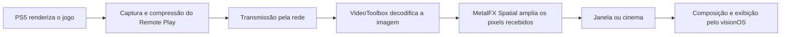

# Análise realista do MetalFX no VisionRemotePS5

Data: 10/09/2026. Escopo: estado comprovado do aplicativo, limites da tecnologia
no Apple Vision Pro e diagnóstico da melhoria de imagem ainda insuficiente.
Documentação Apple consultada pelo MCP Helpike; disponibilidade confrontada com
os headers do SDK visionOS 27 instalado. Inspeção de código, registros anteriores
e feedback do usuário, complementados por dois experimentos GPU isolados no Mac.
A compilação Debug assinada e a suíte GPU da nova correção passaram. A versão
foi instalada e aberta no Vision Pro; o console confirmou fonte 1920×1080,
saída MetalFX 3840×2160 e alvo final 3840×2160. A aceitação visual permanece
pendente.

## Conclusão

**O MetalFX está em execução, mas a qualidade pretendida ainda não foi atendida.
Há ganho sutil confirmado pelo usuário e relatos de resultado insuficiente
também com fonte 1080p. O diagnóstico encontrou outro defeito concreto na janela,
cuja correção foi compilada, testada na GPU do Mac e instalada; o efeito visual
no headset ainda precisa ser validado.**

A primeira correção eliminou o caminho 360p→MetalFX720p→bilinear1440p; depois
dela, o usuário percebeu um ganho sutil. A nova inspeção identificou o problema
complementar: a janela mantinha um alvo 2560×1440 e reduzia a saída
1080p→MetalFX3840×2160 antes da composição. A correção em `MetalTextureView`
desativa o redimensionamento automático do drawable e escolhe seu tamanho pela
fonte decodificada e pela recomendação nativa, com piso 1440p, mínimo de 2× por
dimensão da fonte e teto 4K. Original usa o mesmo alvo para uma comparação justa.

| Fonte efetivamente decodificada | Alvo da janela com a correção |
| --- | --- |
| 1920×1080 | 3840×2160 |
| 1280×720 | Pelo menos 2560×1440; pode subir até 3840×2160 conforme a recomendação de tamanho da janela |
| 960×540 ou 640×360 | Piso 2560×1440 mantido da correção anterior |

Essa política trata a resolução de apresentação no cliente. Os perfis de rede
ainda são escolhidos antes da conexão: não existe no app um controlador que
troque automaticamente 1080p/720p e bitrate conforme a rede. Essa parte da ideia
de adaptação permanece por implementar; não é uma função automática do MetalFX.
O compositor do visionOS continua responsável pela amostragem posterior das
superfícies; a resolução dessas texturas não equivale a uma contagem física de
pixels por olho. [Apple: pipeline do visionOS](https://developer.apple.com/documentation/visionos/understanding-the-visionos-render-pipeline).

Isso remove uma redução desnecessária na janela; **não explica todos os relatos**.
O cinema já usava textura 4K com fonte 1080p. Os testes negativos de 1080p
relatados pelo usuário continuam válidos e não podem ser descartados pela
ausência dessa resolução num recorte recente de logs.

O experimento isolado no M3 Pro mostra comportamento misto do Spatial: texto e
diagonais ficaram mais próximos da referência sintética, enquanto textura fina
periódica piorou. Outro experimento não encontrou perda dos valores codificados
no contrato de cor testado. A decisão atual é corrigir a falha demonstrada e
avaliar seu alcance, sem chamar funcionamento técnico de qualidade atendida,
sem prometer equivalência a uma fonte superior e sem encerrar o diagnóstico
com base apenas na dificuldade de reconstruir 360p.

## Esclarecimento: a demonstração Apple de 1080p para 4K

Após a pergunta do usuário sobre a promessa de melhoria perceptível, foi
conferida a apresentação original
[Boost performance with MetalFX Upscaling — WWDC22](https://developer.apple.com/videos/play/wwdc2022/10103/).
A API foi consultada pelo Helpike; esta transcrição complementar foi consultada
no site oficial da Apple, pois o exemplo não apareceu no catálogo local.

A Apple demonstra **Spatial 1080p→4K**, descrevendo maior nitidez e contornos mais
limpos. O exemplo usa antialiasing temporal próprio antes do Spatial. A palestra
também recomenda entrada com antialiasing e sem ruído. Portanto, a ausência de
MetalFX Temporal no visionOS **não explica, por si só, um resultado visual fraco**:
Spatial também se destina a produzir melhoria perceptível sob condições adequadas.

**Correção de alcance da conclusão:** aumentar o buffer não basta para comprovar
qualidade, mas reduzir MetalFX a uma mudança de tamanho também é incorreto.
O usuário já relatou comparações negativas com entrada 1080p. Um conjunto de
logs de outra execução não invalida essa experiência, nem autoriza presumir
que uma fonte 1080p ainda não foi experimentada. O fator de escala, a compressão
e a amostragem até a apresentação precisam ser considerados para explicar o
resultado. Foi essa inspeção que revelou a redução 4K→1440p na janela; a
correção resolve esse estágio específico, sem estabelecer antecipadamente o
benefício no aparelho ou explicar o resultado do cinema.

## 1. Estado comprovado e trabalho pendente

| Item | Evidência atual | Conclusão permitida |
| --- | --- | --- |
| GPU do aparelho | Console identifica Apple M2 GPU | Esta análise se refere ao aparelho efetivamente testado |
| MetalFX no dispositivo | Logs de inicialização e conclusão GPU; alternância com Original | A execução não é apenas uma alteração de rótulo |
| Primeira correção de escala | Fonte 640×360 → MetalFX 2560×1440 → alvo 2560×1440 | A segunda ampliação bilinear foi eliminada nesse tamanho |
| Falha na janela com fonte 1080p | Inspeção confirmou MetalFX 3840×2160 reduzido ao alvo 2560×1440 | Havia perda de resolução no passe final do app, depois do upscale |
| Nova correção da janela | `autoResizeDrawable=false`; drawable derivado da fonte, piso 1440p, mínimo 2× e teto 4K; mesmo alvo em Original | Debug e suíte GPU passaram; instalada, com 1080p→MetalFX4K→alvo4K confirmado no dispositivo; aceitação visual pendente |
| Cinema com fonte 1080p | A política existente já cria textura 3840×2160 | A falha da janela não explica isoladamente o resultado do cinema |
| Outros perfis | Logs mostram fontes 1280×720 e 960×540; janela/cinema | O processamento aceita as resoluções testadas |
| Qualidade percebida | Usuário confirmou ganho sutil após a primeira correção e relatou resultado insuficiente também em 1080p | Benefício pequeno observado; qualidade pretendida ainda não atendida |
| Correção dos pixels | Teste anterior na GPU do Mac comparou 16.745 posições à API MetalFX direta | Correção daquela saída sintética, sem nota de qualidade no PS5 |
| Spatial contra referência conhecida | Uma execução isolada no M3 Pro comparou 720p/1080p→1440p/4K | Menor erro em texto/diagonais e maior erro em textura periódica; resultado misto, sem PS5 |
| Contrato de cor | Probe M3 Pro comparou Unorm/sRGB perceptual e reproduziu o passe final SDR | Valores idênticos nas regiões testadas; não foi demonstrado um erro de cor que anulasse o efeito |
| Redução de latência | Sem comparação que demonstre redução de ponta a ponta | Benefício de latência não estabelecido |
| Novo controle de nitidez Detail | Experimento arquivado em `/tmp/VisionRemotePS5-unshipped-detail-experiment-20260910` e removido do app ativo | Não foi testado nem entregue; não participa dos resultados |
| Profundidade | Suspensa a pedido do usuário; modelo fora do aplicativo ativo | Não participa da melhoria de imagem analisada |

Os resultados físicos da primeira correção de escala pertencem à versão
registrada em `/tmp/VisionRemotePS5-display-scale-install.log`. A nova política
de tamanho da janela é posterior; uma compilação ou teste sintético bem-sucedido
não substitui a confirmação de seu resultado no headset.

Validação desta correção: Debug assinado com Xcode 27 terminou em `BUILD
SUCCEEDED`, sem avisos de compilação na execução final; a suíte GPU passou
com fidelidade de fonte, split do mesmo frame, paridade SDR/sRGB, comparação
independente com MetalFX direto, fallback e retenção de recursos em voo.
Os testes GPU usam o M3 Pro do Mac e não executam a composição física do headset.
CoreDevice confirmou instalação e abertura de `com.visionremote.ps5` no Vision
Pro. Logs locais: `/tmp/VisionRemotePS5-presentation-target-device-build.log`,
`/tmp/VisionRemotePS5-presentation-target-gpu.log`,
`/tmp/VisionRemotePS5-presentation-target-install.log` e
`/tmp/VisionRemotePS5-presentation-target-console.log`. Após a abertura, esse
console registrou `Source 1920×1080 → Output texture 3840×2160 · Display target
3840×2160` em MetalFX, e alternância para Original mantendo o alvo 3840×2160.
Isso confirma a política no GPU/passe final do app no Vision Pro. Não mede a
resolução física por olho nem estabelece ganho perceptível.

O alvo maior também se aplica a Original para preservar a comparação. Em 4K,
o passe final processa 2,25 vezes os pixels do alvo 1440p anterior, sem que isso
seja uma medida de custo GPU ou latência. Para fontes menores, redimensionar a
janela acima do piso pode recriar o scaler; em tamanho estável ele é reutilizado.

O controle experimental de nitidez foi retirado do código ativo junto com seus
testes não executados. O arquivo temporário preserva o trabalho sem tratá-lo
como uma entrega. Os controles existentes de zoom para inspeção continuam sendo
outra função; não significam que a nova nitidez esteja instalada.

Fontes locais: [registro da correção](low_bandwidth_upscaling_2026_09.md),
`/tmp/VisionRemotePS5-display-scale-console.log`,
`/tmp/VisionRemotePS5-display-scale-gpu.log` e logs Debug/Release de
`display-scale`; [janela](../VisionRemotePS5/Views/MetalTextureView.swift),
[cinema](../VisionRemotePS5/Streaming/ImmersiveCinemaRenderer.swift),
`/tmp/VisionRemotePS5-spatial-quality-probe-20260910/results.json` e
`/tmp/VisionRemotePS5-metalfx-color-probe/results.txt`. Os arquivos temporários
são evidência local desta sessão, não artefatos versionados permanentes.

## 2. O que o MetalFX recebe neste aplicativo

O MetalFX atua depois da compressão, transmissão e decodificação. O bridge
entrega vídeo comprimido e informações de perda/recuperação; o decoder produz
uma imagem BGRA. Este caminho não entrega profundidade do jogo, vetores de
movimento do renderizador, geometria ou controle sobre a amostragem temporal.
Isso é verificável no
[callback de vídeo e decoder](../VisionRemotePS5/Services/StreamingService.swift),
no [bridge](../VisionRemotePS5/Chiaki/ChiakiCore.h) e no
[mailbox](../VisionRemotePS5/Streaming/UpscalingPipeline.swift).

A documentação geral da Apple apresenta MetalFX como forma de economizar
renderização: produzir uma cena em resolução menor pode custar menos do que
renderizá-la diretamente na resolução de saída. Ela distingue a modalidade
espacial, que recebe cor, da temporal, que também utiliza profundidade e
movimento. [Apple: MetalFX](https://developer.apple.com/documentation/metalfx).

**Essa economia não se transfere automaticamente para Remote Play.** Nosso
aplicativo não renderiza a cena do jogo no Vision Pro; recebe uma imagem pronta.
O pedido de resolução do stream não equivale a controlar a resolução interna
de renderização do jogo no PS5. Em comparação com exibir o mesmo frame recebido
em Original, adicionar MetalFX acrescenta processamento no cliente.

## 3. O que a Apple disponibiliza no visionOS

| Tecnologia | Situação nesta configuração | Consequência prática |
| --- | --- | --- |
| MetalFX Spatial | Disponível e em execução | Analisa espacialmente uma textura de cor para produzir uma textura maior |
| Metal 4 Spatial | API documentada para visionOS 26+, sujeita ao suporte do dispositivo | Outra integração de comandos; não há promessa documentada de salto visual |
| MetalFX Temporal | Factory e protocolo concreto indisponíveis no SDK visionOS 27 | Não é uma opção que podemos simplesmente ativar |
| Temporal Denoised / Frame Interpolator | APIs concretas também indisponíveis nesse SDK | Não fornecem um atalho aplicável para este app |
| Modelo próprio de super-resolução | Não integrado | Exigiria outra solução, com qualidade e custo ainda desconhecidos |

O contrato do [Spatial](https://developer.apple.com/documentation/metalfx/mtlfxspatialscaler)
é uma textura de entrada e uma textura ampliada. Seu
[descritor](https://developer.apple.com/documentation/metalfx/mtlfxspatialscalerdescriptor)
expõe dimensões, formatos, espaço de cor e criação do scaler. Não há nele um
seletor público de qualidade neural ou de intensidade de reconstrução.
Espaço de cor é interpretação dos dados, não um controle de qualidade.

O [Metal 4 Spatial](https://developer.apple.com/documentation/metalfx/mtl4fxspatialscaler)
herda a mesma interface base espacial. **Inferência de engenharia:** não há
fundamento nas fontes consultadas para investir numa migração apenas esperando
uma imagem muito melhor. Eventual ganho de integração/desempenho teria de ser
avaliado separadamente.

A indisponibilidade temporal foi confirmada nos headers locais
`MTLFXTemporalScaler.h`, `MTL4FXTemporalScaler.h`,
`MTLFXTemporalDenoisedScaler.h` e `MTLFXFrameInterpolator.h`, sob
`XROS.sdk/System/Library/Frameworks/MetalFX.framework/Headers`, que marcam as
APIs concretas como `API_UNAVAILABLE(visionos)`. Isso é uma conclusão sobre o
SDK instalado, não uma previsão sobre versões futuras. Uma listagem de protocolo
base no catálogo não substitui a disponibilidade da API concreta.

Referências públicas correspondentes:
[Temporal](https://developer.apple.com/documentation/metalfx/mtlfxtemporalscaler),
[Temporal Denoised](https://developer.apple.com/documentation/metalfx/mtlfxtemporaldenoisedscalerdescriptor)
e [Frame Interpolator](https://developer.apple.com/documentation/metalfx/mtlfxframeinterpolatordescriptor).

Mesmo em outra plataforma que permita Temporal, seriam necessários dados
adequados ao seu contrato. Estimar movimento ou profundidade a partir do vídeo
seria trabalho adicional, com erros próprios; não equivale a receber os dados do
renderizador do PS5.

Também é necessário cuidado com a palavra “IA”: o app usa MetalFX Spatial e
não integra um modelo próprio de reconstrução. As páginas consultadas não
estabelecem que essa variante espacial ofereça a reconstrução neural pretendida.
Isso não autoriza afirmar que toda a família MetalFX usa, ou não usa, ML.

## 4. Por que 2106p/2160p no painel não significa esse nível de detalhe

O console registrou uma saída de **3744×2106** durante o redimensionamento da
janela, além de 3840×2160. Esses números descrevem a textura que foi criada.
Não são uma medição de resolução efetiva, legibilidade ou detalhe reconstruído.

Há três grandezas diferentes:

1. **Fonte:** pixels decodificados que realmente chegaram do PS5.
2. **Saída ampliada:** pixels calculados pelo scaler.
3. **Imagem percebida:** resultado de colocar essa textura numa superfície e
   exibi-la pelo sistema óptico e pelo compositor.

| Fonte | Pixels da fonte | Saída ilustrativa | Aumento da quantidade de pixels |
| --- | ---: | --- | ---: |
| 640×360 | 230.400 | 2560×1440 | 16× |
| 640×360 | 230.400 | 3840×2160 | 36× |
| 960×540 | 518.400 | 2560×1440 | 7,11× |
| 1280×720 | 921.600 | 2560×1440 | 4× |
| 1920×1080 | 2.073.600 | 3840×2160 | 4× |

São cálculos de dimensões, não índices de qualidade. No exemplo 360p→4K,
produzir 36 vezes mais pixels não fornece 36 vezes mais informação independente.
Textos e texturas eliminados pela redução e compressão não podem ser recuperados
com fidelidade garantida a partir daquela única imagem.

Há também uma dimensão intermediária que precisa ser conferida: **o drawable
do app**. A saída 3840×2160 do scaler não bastava quando a janela a reduzia
para 2560×1440. A política corrigida mantém um drawable 4K para fonte 1080p,
incluindo Original, antes de entregar o resultado ao sistema. Isso elimina
essa redução controlada pelo app; não transforma a dimensão da textura numa
medição de resolução percebida. O cinema com entrada 1080p já usava esse tamanho.

Além disso, a textura passa pela composição do visionOS. A Apple descreve o
render server, compositor e atualização física como etapas distintas.
**Inferência:** aumentar o buffer não garante uma correspondência de um pixel
da textura para um pixel visível no olho; tamanho angular, posição e composição
também importam.
[Apple: pipeline do visionOS](https://developer.apple.com/documentation/visionos/understanding-the-visionos-render-pipeline).

## 5. O que explica parte da diferença e o que ainda não foi explicado

**Original já amplia a imagem.** Ele usa amostragem bilinear para preencher o
mesmo alvo. A comparação é entre métodos de ampliação do mesmo conteúdo, não
entre uma imagem pequena sem processamento e uma imagem grande.

**A fonte de 360p é muito limitada para menus e detalhes finos.** Escolhê-la
como pior caso foi útil para expor limitações, mas foi uma má base para esperar
qualidade próxima de uma fonte superior. Maior degradação pode apagar exatamente
as estruturas que o scaler precisaria preservar. Essa observação não responde
aos relatos negativos do usuário com fonte 1080p e não deve substituí-los.

**Foram identificadas duas falhas de escala em estágios diferentes.** Primeiro,
360p→MetalFX720p→bilinear1440p; a correção direta foi útil e foi seguida pelo
relato de ganho sutil. Depois, a inspeção da janela confirmou
1080p→MetalFX4K→redução1440p. A segunda correção mantém o alvo adequado à saída
do scaler. Seu efeito perceptivo está pendente; não é válido declarar que isso
resolveu a insatisfação, especialmente porque o cinema já tinha alvo 4K.

**Os testes anteriores responderam à pergunta técnica errada para aceitação do
produto.** Pixels diferentes, dimensões maiores, compilação e conclusão GPU
comprovam partes do funcionamento. Não comprovam preferência visual. O teste
de referência direta confirmou o caminho, mas não foi uma comparação com uma
imagem original de alta resolução da mesma cena.

**Enhanced não oferecia uma alternativa válida nos perfis baixos.** Sua
implementação atual exige 1080p e retorna Original em 360p/540p/720p, com aviso.
Isso aparece nos logs. Não há ganho desse filtro a avaliar nesses perfis.

As capturas do headset também não são uma referência perfeita de pixels vistos
pelo usuário. A Apple explica que a renderização foveada e outras otimizações
podem não se traduzir bem para imagens 2D; Developer Capture altera o caminho
de captura. Isso limita medições feitas nas screenshots, mas **não invalida os
relatos de ganho pequeno ou insuficiente enquanto o usuário usava o aparelho,
inclusive em 1080p**.
[Apple: capturas do Vision Pro](https://developer.apple.com/documentation/visionos/capturing-screenshots-and-video-from-your-apple-vision-pro-for-2d-viewing).

Eu deveria ter separado essas limitações mais cedo e condicionado a continuidade
ao benefício visual. Parte do esforço corrigiu problemas necessários; o erro
foi tratar esses avanços técnicos como se estivessem levando, por si só, à
reconstrução de qualidade pretendida.

### 5.1. Spatial isolado contra uma referência sintética conhecida

Foi executado um experimento na GPU Apple M3 Pro, com Xcode 27, separado do app.
A referência 3840×2160 foi gerada localmente com CoreGraphics/CoreText: texto,
diagonais, textura periódica fina e uma borda suave inclinada. As entradas
1920×1080 e 1280×720 vieram de redução por média exata da área dos pixels, em
valores SDR codificados. A referência 1440p foi derivada da mesma imagem 4K.

Cada entrada foi ampliada diretamente para 1440p e 4K pela API
`MTLFXSpatialScaler`, em modo perceptual, e por um shader bilinear independente.
O experimento não usa o wrapper do app, o filtro Enhanced ou a nitidez arquivada.
Não inclui PS5, compressão HEVC, movimento ou apresentação no headset.

| Fonte → alvo | ΔPSNR imagem inteira | ΔPSNR texto | ΔPSNR diagonais | ΔPSNR textura fina |
| --- | ---: | ---: | ---: | ---: |
| 1080p → 1440p | −4,734 dB | +2,020 dB | +3,032 dB | −8,027 dB |
| 1080p → 4K | −2,930 dB | +2,321 dB | +2,985 dB | −6,465 dB |
| 720p → 1440p | −0,810 dB | +2,371 dB | +3,164 dB | −3,986 dB |
| 720p → 4K | −0,425 dB | +1,077 dB | +1,386 dB | −2,645 dB |

ΔPSNR é MetalFX menos bilinear, calculado a partir do erro quadrático médio dos
canais RGB codificados contra a referência. Positivo significa menor erro
naquela região; **não é uma nota de qualidade perceptiva total**. Os recortes
mostram texto e traços mais definidos com Spatial, mas a textura periódica
adversarial apresenta contraste/aliasing acentuados e pior fidelidade. Essa
região influencia o resultado global; nenhum dos lados deve ser omitido.

A transição 10–90% da borda ficou mais estreita com Spatial e apresentou
ultrapassagem de 1–4 níveis nos valores de referência de 8 bits. Mais estreita
nem sempre foi mais fiel: em 1080p→1440p, a largura da referência era 2,843 pixels,
a bilinear 3,333 e a Spatial 2,175. Essa medição usa uma linha e uma fase
específicas da borda sintética, não uma avaliação completa de contornos.

O resultado comprova comportamento dependente do conteúdo nessa execução da
API. Sustenta a possibilidade de benefício espacial em estruturas concretas;
também mostra perdas. Não comprova qualidade atendida no Remote Play nem
contradiz o ganho sutil já relatado pelo usuário. Dados, fonte reproduzível e
PNGs estão em `/tmp/VisionRemotePS5-spatial-quality-probe-20260910`, incluindo
`results.json`, `README.md`, `*-comparison.png` e os contrapontos
`*-texture-comparison.png`.

### 5.2. Verificação isolada do contrato de cor

Um segundo probe no M3 Pro comparou os mesmos bytes BGRA declarados como
`.bgra8Unorm` e `.bgra8Unorm_srgb`, ambos com Spatial perceptual, em
720p→1440p e 1080p→4K. Nas quatro regiões testadas — rampa cinza, borda,
textura colorida e cores constantes — a saída bruta foi idêntica byte a byte.
A reprodução isolada do passe final SDR da janela e do cinema também preservou
exatamente os valores da saída, com a conversão apropriada ao formato final.

Portanto, **não foi demonstrado um erro nesse contrato que neutralizasse o
MetalFX**. Isso não prova correção universal de cor: o teste preserva os mesmos
valores codificados e não avalia a conversão de primárias/transferência
BT.709 ou SMPTE-C para sRGB, nem a aparência óptica no headset. Evidência:
`/tmp/VisionRemotePS5-metalfx-color-probe/results.txt`. Não há fundamento nesse
resultado para trocar formatos apenas esperando recuperar um efeito perdido.

## 6. Rede, latência e custo no Vision Pro

Os perfis disponíveis solicitam 360p/2 Mbps, 540p/6 Mbps, 720p/10 Mbps ou
1080p/15 Mbps, todos a 60 fps. Eles alteram resolução e bitrate juntos.
Portanto, as trocas feitas não isolam o efeito de cada variável.

Menor bitrate solicitado pode reduzir o volume transmitido e aliviar filas
numa rede congestionada. Isso não significa necessariamente pacotes individuais
menores, não mede a vazão real e não demonstra menor tempo entre botão e imagem.
Numa rede já folgada, a economia pode produzir pouca ou nenhuma melhora
perceptível de latência. Essas são possibilidades de engenharia; não resultados
medidos neste projeto.

MetalFX trabalha depois da decodificação, não recupera pacotes da rede e não
elimina o tempo anterior de captura, compressão ou trânsito. Seu próprio trabalho
na GPU deve entrar na conta.

Como referência de custo, uma textura BGRA8 de 2560×1440 tem 14,06 MiB de dados
nominais; uma de 3840×2160 tem 31,64 MiB. Isso exclui alinhamento, recursos internos
do scaler e buffers do sistema. A imagem 4K tem 2,25 vezes mais pixels do que a
1440p, mas esse fator não deve ser confundido com uma razão medida de tempo GPU.
O filtro de nitidez arquivado acrescentaria amostragens mesmo sem alocar outra
textura; ele não está no app ativo.

O registro local contém execução bem-sucedida, não uma demonstração do melhor
compromisso qualidade/latência. As medições dispensadas pelo usuário permanecem
dispensadas; esta conclusão não depende de reabrir aquela campanha.

## 7. O que podemos realisticamente alcançar

| Caminho | Expectativa defensável | Limite / decisão |
| --- | --- | --- |
| MetalFX atual | Benefício em texto/diagonais no experimento sintético e ganho sutil relatado no aparelho | Corrigir a apresentação demonstradamente inadequada e validar seu alcance; não prometer recuperação nativa 4K |
| Nitidez adicional | Maior contraste aparente de detalhes existentes | Pode destacar compressão e contornos; experimento arquivado, não testado, não entregue e fora do app ativo |
| Melhor fonte recebida | Preservar mais informação antes do upscale | Custa mais banda; é a direção mais fundamentada para legibilidade, sem promessa de perfil ideal ainda |
| Ajustar bitrate sem reduzir tanto a resolução | Explorar outro compromisso entre detalhe e compressão | Os presets atuais não isolam isso; seria teste futuro delimitado, não solução comprovada |
| Migrar para Metal 4 | Eventual benefício de integração/desempenho | Não existe evidência de salto visual só pela migração |
| Otimizar apresentação no visionOS 27 | Possível redução de cópias/atraso de apresentação | Trata latência, não recupera detalhes da fonte |
| Super-resolução neural própria | Inferência de detalhes plausíveis | Novo trabalho de pesquisa; custo, fidelidade de texto e estabilidade temporal desconhecidos |
| 360p/2 Mbps com detalhe equivalente a 4K nativo | Nenhuma evidência que sustente essa meta com o Spatial atual | Não prometer nem orientar mais horas de ajustes para essa expectativa |

A alternativa concreta documentada para apresentação é o exemplo Apple
[Displaying low-latency connected video](https://developer.apple.com/documentation/realitykit/displaying-low-latency-connected-video),
para visionOS 27. Ele usa compartilhamento de texturas entre Metal e RealityKit
com `LowLevelDeviceResource` e admite fontes de vídeo sem fio. Nosso cinema
usa `LowLevelTexture.replace(using:)`; esse outro caminho ainda não foi comparado.
O exemplo fundamenta uma hipótese de redução de sobrecarga, não uma promessa de
imagem mais detalhada ou uma recomendação de migração imediata.

## 8. Decisão recomendada

**Concluir o diagnóstico e a correção da apresentação, mantendo a qualidade como
objetivo ainda não atendido.** A hipótese atual tem evidência concreta: o drawable
1440p da janela reduzia a saída 4K. Ela é diferente de experimentar novos filtros
sem identificar onde o resultado se perdia.

1. Compilação, regressões GPU, instalação e abertura foram concluídas para a
   política de tamanho implementada, preservando o mesmo alvo em Original e
   MetalFX. O console já confirmou transmissão 1080p com saída e alvo 4K no
   Vision Pro; esse resultado técnico não antecipa a preferência visual do usuário.
2. Distinguir o resultado da janela corrigida do cinema, que já usava textura 4K
   com fonte 1080p. Preservar os relatos negativos anteriores; a nova correção
   não os apaga nem demonstra que o problema inteiro foi resolvido.
3. Usar a comparação existente para avaliar o benefício da correção no tamanho
   habitual, sem confundir zoom de inspeção com melhora útil. Legibilidade,
   contornos e estabilidade visual continuam relevantes; diferenças numéricas
   de pixels e aprovação de build não substituem esse resultado.
4. Se a melhora continuar insuficiente, registrar esse limite nas condições
   efetivamente usadas e exigir outra hipótese verificável antes de alterar o
   algoritmo. Não prolongar a tentativa com novos filtros, formatos de cor ou
   migração de API sem evidência de que atuam na causa observada.

Os perfis superiores preservam mais informação antes do upscale, mas recomendar
1080p como se ele ainda não tivesse sido testado não responde ao usuário. Não foi
demonstrado um perfil ideal para sua rede nem equivalência à fonte de maior
resolução. A aceitação permanece aberta mesmo com o ganho sutil confirmado.

O experimento Detail está arquivado e não faz parte desta entrega. Seu código e
seus testes não executados não sustentam qualquer conclusão de benefício.

Uma futura proposta de super-resolução neural deve ter viabilidade e resultado
comparativo próprios antes de entrar no roteiro principal. Não é algo que possa
ser prometido como consequência de continuar ajustando MetalFX.

## Rastreabilidade da consulta

Packs utilizados no MCP Helpike: `apple/metalfx`, `apple/visionos` e
`apple/realitykit`. As páginas canônicas estão vinculadas junto às conclusões.
Recursos locais principais consultados:

- `md-deep/metalfx/metalfx.md`
- `md-deep/metalfx/metalfx__mtlfxspatialscaler.md`
- `md-deep/metalfx/metalfx__mtlfxspatialscalerdescriptor.md`
- `md-deep/metalfx/metalfx__mtl4fxspatialscaler.md`
- `md-deep/visionos/visionos__understanding-the-visionos-render-pipeline.md`
- `md-deep/visionos/visionos__capturing-screenshots-and-video-from-your-apple-vision-pro-for-2d-viewing.md`
- `md-deep/realitykit/realitykit__displaying-low-latency-connected-video.md`

Disponibilidade adicional: headers MetalFX do Xcode em
`/Applications/Xcode-beta.app/Contents/Developer/Platforms/XROS.platform/Developer/SDKs/XROS.sdk`.
O relatório não assume paridade entre demonstrações de um jogo renderizado
localmente e o vídeo comprimido recebido pelo Remote Play.
