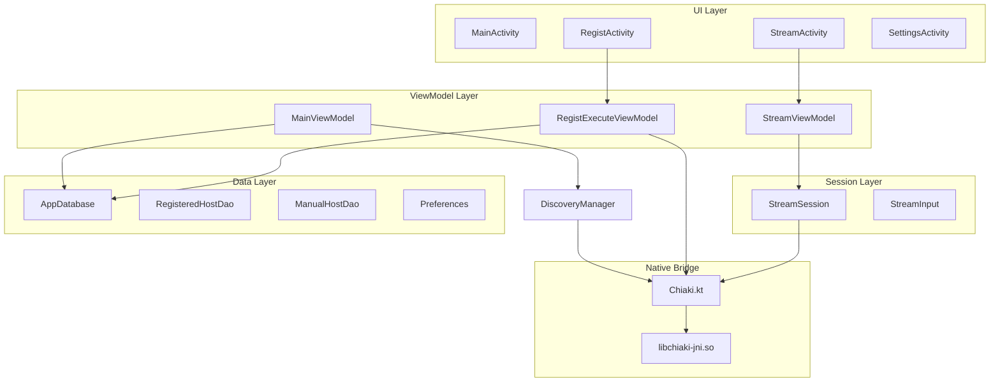

# Android Chiaki-ng: Project Overview

> **Purpose**: Complete architecture reference for porting chiaki-ng to visionOS  
> **Source Path**: `chiaki-ng/android/app/src/main/java/com/metallic/chiaki/`

---

## Package Structure

```
com.metallic.chiaki/
├── lib/                    # JNI Bridge (Chiaki.kt)
├── common/                 # Data models & persistence
├── discovery/              # Console discovery
├── regist/                 # Registration flow
├── session/                # Streaming session
├── stream/                 # Streaming UI
├── touchcontrols/          # On-screen controls
├── settings/               # App settings
├── main/                   # Main screen
└── manualconsole/          # Manual host entry
```

---

## Documentation Files

| File | Description |
|------|-------------|
| [android_01_jni_bridge.md](./android_01_jni_bridge.md) | Native library interface, Session, Discovery, Regist classes |
| [android_02_streaming.md](./android_02_streaming.md) | StreamSession, StreamInput, controller input handling |
| [android_03_discovery.md](./android_03_discovery.md) | DiscoveryManager, UDP broadcast protocol |
| [android_04_registration.md](./android_04_registration.md) | RegistExecuteViewModel, registration state machine |
| [android_05_data_models.md](./android_05_data_models.md) | Room database, RegisteredHost, ManualHost, DisplayHost |
| [android_06_controller_input.md](./android_06_controller_input.md) | TouchControlsFragment, button/stick mapping |
| [android_07_ui_components.md](./android_07_ui_components.md) | StreamActivity, UI lifecycle, dialogs |

---

## Architecture Diagram



---

## Core Data Flow

### 1. Console Discovery
```
DiscoveryManager → DiscoveryService (native) → UDP broadcast
                                             ← DiscoveryHost list
```

### 2. Registration
```
RegistInfo (PIN + console IP) → Regist (native) → PS5 HTTP API
                                               ← RegistHost (credentials)
RegisteredHost → Room Database
```

### 3. Streaming
```
ConnectInfo → Session (native) → PS5 connection
                              ← Video frames (to Surface)
                              ← Events (connected, quit, rumble)
ControllerState → Session → PS5
```

---

## Key Types Summary

### From Native (Chiaki.kt)

| Type | Purpose |
|------|---------|
| `Target` | PS4/PS5 version enum |
| `ConnectInfo` | Connection parameters |
| `ConnectVideoProfile` | Resolution, FPS, codec |
| `ControllerState` | Full controller input |
| `Session` | Streaming session wrapper |
| `DiscoveryService` | Console discovery |
| `Regist` | Registration handler |

### Data Models

| Type | Purpose |
|------|---------|
| `RegisteredHost` | Stored credentials |
| `ManualHost` | Manual IP entry |
| `DisplayHost` | UI display wrapper |
| `MacAddress` | 6-byte MAC storage |

### Session States

| State | Description |
|-------|-------------|
| `StreamStateIdle` | Not connected |
| `StreamStateConnecting` | Connection in progress |
| `StreamStateConnected` | Streaming active |
| `StreamStateQuit` | Session ended |
| `StreamStateLoginPinRequest` | PIN needed |
| `StreamStateCreateError` | Failed to create session |

---

## visionOS Porting Checklist

### ✅ Already Implemented
- [ ] Basic project structure
- [ ] Chiaki.xcframework integration
- [ ] ChiakiFullSession Swift wrapper
- [ ] Basic video callback

### 🔲 To Implement

#### Core
- [ ] Fix video frame callback (library patch)
- [ ] Video decoding with VideoToolbox
- [ ] Metal rendering pipeline
- [ ] Audio output (AVAudioEngine)

#### Discovery & Registration
- [ ] UDP discovery service
- [ ] Registration flow UI
- [ ] Console storage (SwiftData/JSON)

#### Controller Input
- [ ] GCController integration
- [ ] DualSense via Bluetooth
- [ ] Motion sensor support
- [ ] Haptic feedback (CoreHaptics)

#### UI
- [ ] Immersive streaming view
- [ ] Console list (discovered + manual)
- [ ] Settings screen
- [ ] Connection status indicators

---

## Files Analyzed

| File | Lines | Key Classes |
|------|-------|-------------|
| `Chiaki.kt` | 535 | Session, DiscoveryService, Regist, ControllerState |
| `StreamSession.kt` | 147 | StreamSession, StreamState |
| `StreamInput.kt` | 206 | StreamInput (sensor/key/motion/touch input) |
| `DiscoveryManager.kt` | 130 | DiscoveryManager |
| `RegistExecuteViewModel.kt` | 126 | RegistExecuteViewModel |
| `RegisteredHost.kt` | 101 | RegisteredHost, RegisteredHostDao |
| `AppDatabase.kt` | 63 | AppDatabase, Converters |
| `ManualHost.kt` | 59 | ManualHost, ManualHostDao |
| `DisplayHost.kt` | 58 | DisplayHost, DiscoveredDisplayHost, ManualDisplayHost |
| `TouchControlsFragment.kt` | 127 | TouchControlsFragment, DefaultTouchControlsFragment |
| `StreamActivity.kt` | 399 | StreamActivity, TransformMode |

**Total**: ~2000 lines of Kotlin analyzed

---

## Technology Mapping

| Android | visionOS |
|---------|----------|
| Room Database | SwiftData / Codable JSON |
| LiveData / RxJava | Combine / @Published |
| ViewModel | ObservableObject |
| Fragment | SwiftUI View |
| SurfaceView | AVSampleBufferDisplayLayer / Metal |
| SensorManager | CMMotionManager |
| KeyEvent / MotionEvent | GCController |
| Vibrator | CoreHaptics |
| Material Design | SwiftUI native |
