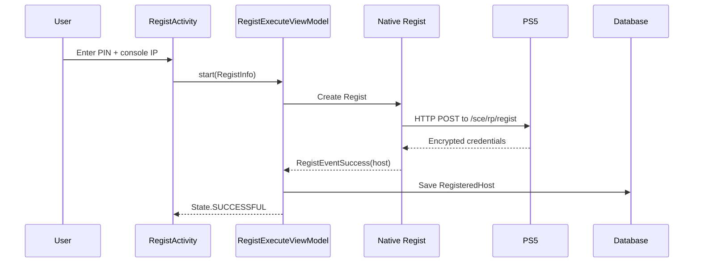

# Android Chiaki-ng: Registration Documentation

> **Package**: `com.metallic.chiaki.regist`  
> **Files**: `RegistExecuteViewModel.kt`, `RegistActivity.kt`, `RegistExecuteActivity.kt`  
> **Purpose**: Console registration flow and state management

---

## Overview

Registration is the process of pairing the app with a PlayStation console using an 8-digit PIN displayed on the console. This creates authentication credentials stored locally.

---

## RegistActivity.kt (148 lines)

Registration input UI activity.

### Intent Extras

```kotlin
companion object {
    const val EXTRA_HOST = "regist_host"           // Pre-filled IP
    const val EXTRA_BROADCAST = "regist_broadcast" // Use broadcast
    const val EXTRA_ASSIGN_MANUAL_HOST_ID = "assign_manual_host_id"
    private const val PIN_LENGTH = 8
}
```

### Console Version Selection

```kotlin
enum class ConsoleVersion {
    PS5,         // Target.PS5_1
    PS4_GE_8,    // Target.PS4_10 (firmware >= 8.0)
    PS4_GE_7,    // Target.PS4_9  (firmware >= 7.0)
    PS4_LT_7     // Target.PS4_8  (firmware < 7.0)
}
```

### PSN ID Handling

```kotlin
// For PS5 and PS4 >= 7.0: psnAccountId (Base64 encoded, 8 bytes)
val psnAccountId: ByteArray? = Base64.decode(psnId, Base64.DEFAULT)
val psnIdValid = psnAccountId.size == RegistInfo.ACCOUNT_ID_SIZE  // 8

// For PS4 < 7.0: psnOnlineId (plain string)
val psnOnlineId: String? = psnId
val psnIdValid = psnOnlineId?.isNotEmpty() ?: false
```

### PIN Validation

```kotlin
val pin = binding.pinEditText.text.toString()
val pinValid = pin.length == PIN_LENGTH  // Must be exactly 8 digits

// Create RegistInfo with validated data
val registInfo = RegistInfo(target, host, broadcast, psnOnlineId, psnAccountId, pin.toInt())
```

### Navigation Flow

```
RegistActivity (input form)
    ↓ [startActivityForResult]
RegistExecuteActivity (progress/status)
    ↓ [RESULT_OK on success]
RegistActivity.finish()
```

---

## RegistExecuteViewModel.kt (126 lines)

ViewModel that manages the registration state machine.

### Class Definition

```kotlin
class RegistExecuteViewModel(val database: AppDatabase): ViewModel()
```

### States

```kotlin
enum class State {
    IDLE,                // Not started
    RUNNING,             // Registration in progress
    STOPPED,             // User cancelled
    FAILED,              // Registration failed
    SUCCESSFUL,          // Registered and saved
    SUCCESSFUL_DUPLICATE // Already registered (update)
}
```

### Properties

| Property | Type | Description |
|----------|------|-------------|
| `state` | `LiveData<State>` | Current registration state |
| `logText` | `LiveData<String>` | Log output for display |
| `host` | `RegistHost?` | Result on success |

### Methods

#### `start(info: RegistInfo, assignManualHostId: Long?)`
Begins registration:
```kotlin
fun start(info: RegistInfo, assignManualHostId: Long?) {
    regist = Regist(info, log.log, this::registEvent)
    _state.value = State.RUNNING
}
```

#### `stop()`
Cancels registration:
```kotlin
fun stop() {
    regist?.stop()
}
```

#### `saveHost()`
Saves successful registration to database:
```kotlin
fun saveHost() {
    val registeredHost = RegisteredHost(host)
    dao.deleteByMac(registeredHost.serverMac)  // Remove existing
        .andThen(dao.insert(registeredHost))   // Insert new
        .subscribe {
            _state.value = State.SUCCESSFUL
        }
}
```

### Event Handling

```kotlin
private fun registEvent(event: RegistEvent) {
    when(event) {
        is RegistEventCanceled -> _state.postValue(State.STOPPED)
        is RegistEventFailed -> _state.postValue(State.FAILED)
        is RegistEventSuccess -> registSuccess(event.host)
    }
}

private fun registSuccess(host: RegistHost) {
    this.host = host
    // Check if MAC already exists in database
    database.registeredHostDao().getByMac(MacAddress(host.serverMac))
        .doOnSuccess { _state.value = State.SUCCESSFUL_DUPLICATE }
        .doOnComplete { saveHost() }
        .subscribe()
}
```

### Lifecycle

```kotlin
override fun onCleared() {
    regist?.dispose()
    disposable.dispose()
}
```

---

## ChiakiRxLog.kt (25 lines)

RxJava wrapper for ChiakiLog that accumulates log text.

```kotlin
class ChiakiRxLog(levelMask: Int) {
    val logText: Observable<String>  // Full accumulated log
    val log: ChiakiLog               // Underlying logger
    
    // Callback appends new lines to accumulated text
    init {
        log = ChiakiLog(levelMask) { level, text ->
            val cur = accSubject.value ?: ""
            accSubject.onNext(cur + "\n" + ChiakiLog.formatLog(level, text))
        }
    }
}
```

**Use Case**: Displays live registration progress in the RegistExecuteActivity UI.

---

## RegistInfo (from Chiaki.kt)

Input parameters for registration:

```kotlin
data class RegistInfo(
    val target: Target,          // PS4/PS5 version
    val host: String,            // Console IP address
    val broadcast: Boolean,      // Use broadcast discovery
    val psnOnlineId: String?,    // PSN Online ID (PS4 only)
    val psnAccountId: ByteArray?, // Account ID (PS5, 8 bytes)
    val pin: Int                  // 8-digit PIN from console
)
```

**Important**: PS5 requires `psnAccountId` (8 bytes from PSN login), while PS4 uses `psnOnlineId`.

---

## RegistHost (from Chiaki.kt)

Successful registration result:

```kotlin
data class RegistHost(
    val target: Target,
    val apSsid: String,
    val apBssid: String,
    val apKey: String,
    val apName: String,
    val serverMac: ByteArray,   // Console MAC (6 bytes)
    val serverNickname: String, // Console display name
    val rpRegistKey: ByteArray, // Registration key (16 bytes)
    val rpKeyType: UInt,
    val rpKey: ByteArray        // RP-Key for connection (16 bytes)
)
```

---

## Registration Flow



---

## visionOS Implementation Mapping

| Android | visionOS Equivalent |
|---------|---------------------|
| `RegistExecuteViewModel` | `RegistrationService.swift` |
| `RegistInfo` | `ChiakiRegistInfo` struct |
| `RegistHost` | `RegisteredConsole` model |
| Room Database | SwiftData / Codable JSON |
| LiveData | `@Published` + Combine |

### Key Considerations

1. **PSN Account ID** - Must be obtained from PSN OAuth login flow
2. **HTTPS Certificate** - PS5 uses self-signed cert, need to accept it
3. **Network Access** - Requires same LAN as console
4. **PIN Validity** - PIN expires after ~300 seconds
