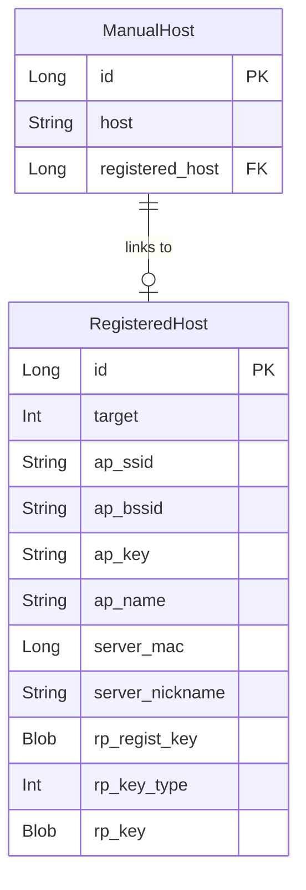

# Android Chiaki-ng: Data Models & Persistence

> **Package**: `com.metallic.chiaki.common`  
> **Files**: `AppDatabase.kt`, `RegisteredHost.kt`, `ManualHost.kt`, `DisplayHost.kt`, `MacAddress.kt`  
> **Purpose**: Local data persistence using Room database

---

## Database Architecture



---

## AppDatabase.kt (63 lines)

Room database singleton.

```kotlin
@Database(
    version = 2,
    entities = [RegisteredHost::class, ManualHost::class]
)
@TypeConverters(Converters::class)
abstract class AppDatabase: RoomDatabase() {
    abstract fun registeredHostDao(): RegisteredHostDao
    abstract fun manualHostDao(): ManualHostDao
    abstract fun importDao(): ImportDao
}
```

### Singleton Access
```kotlin
private var database: AppDatabase? = null

fun getDatabase(context: Context): AppDatabase {
    return database ?: Room.databaseBuilder(
        context.applicationContext,
        AppDatabase::class.java,
        "chiaki"
    )
    .addMigrations(MIGRATION_1_2)
    .build()
    .also { database = it }
}
```

### Type Converters
```kotlin
private class Converters {
    @TypeConverter
    fun macFromValue(v: Long) = MacAddress(v)

    @TypeConverter
    fun macToValue(addr: MacAddress) = addr.value

    @TypeConverter
    fun targetFromValue(v: Int) = Target.fromValue(v)

    @TypeConverter
    fun targetToValue(target: Target) = target.value
}
```

---

## RegisteredHost.kt (101 lines)

Stored credentials from successful registration.

### Entity Definition

```kotlin
@Entity(tableName = "registered_host")
data class RegisteredHost(
    @PrimaryKey(autoGenerate = true) val id: Long = 0,
    @ColumnInfo(name = "target") val target: Target,
    @ColumnInfo(name = "ap_ssid") val apSsid: String?,
    @ColumnInfo(name = "ap_bssid") val apBssid: String?,
    @ColumnInfo(name = "ap_key") val apKey: String?,
    @ColumnInfo(name = "ap_name") val apName: String?,
    @ColumnInfo(name = "server_mac") val serverMac: MacAddress,
    @ColumnInfo(name = "server_nickname") val serverNickname: String?,
    @ColumnInfo(name = "rp_regist_key", typeAffinity = BLOB) val rpRegistKey: ByteArray,
    @ColumnInfo(name = "rp_key_type") val rpKeyType: Int,
    @ColumnInfo(name = "rp_key", typeAffinity = BLOB) val rpKey: ByteArray
)
```

### Constructor from RegistHost
```kotlin
constructor(registHost: RegistHost) : this(
    target = registHost.target,
    apSsid = registHost.apSsid,
    // ... maps all fields from RegistHost
    serverMac = MacAddress(registHost.serverMac),
    rpRegistKey = registHost.rpRegistKey,
    rpKey = registHost.rpKey
)
```

### DAO Methods

```kotlin
@Dao
interface RegisteredHostDao {
    @Query("SELECT * FROM registered_host")
    fun getAll(): Flowable<List<RegisteredHost>>

    @Query("SELECT * FROM registered_host WHERE server_mac == :mac LIMIT 1")
    fun getByMac(mac: MacAddress): Maybe<RegisteredHost>

    @Query("DELETE FROM registered_host WHERE server_mac == :mac")
    fun deleteByMac(mac: MacAddress): Completable

    @Delete
    fun delete(host: RegisteredHost): Completable

    @Query("SELECT COUNT(*) FROM registered_host")
    fun count(): Flowable<Int>

    @Insert
    fun insert(host: RegisteredHost): Single<Long>
}
```

---

## ManualHost.kt (59 lines)

Manually entered console IP addresses.

### Entity Definition

```kotlin
@Entity(tableName = "manual_host",
    foreignKeys = [ForeignKey(
        entity = RegisteredHost::class,
        parentColumns = ["id"],
        childColumns = ["registered_host"],
        onDelete = SET_NULL
    )]
)
data class ManualHost(
    @PrimaryKey(autoGenerate = true) val id: Long = 0,
    val host: String,  // IP address or hostname
    @ColumnInfo(name = "registered_host") val registeredHost: Long?
)
```

### Join with RegisteredHost
```kotlin
data class ManualHostAndRegisteredHost(
    @Embedded(prefix = "manual_host_") val manualHost: ManualHost,
    @Embedded val registeredHost: RegisteredHost?
)
```

### DAO Methods

```kotlin
@Dao
interface ManualHostDao {
    @Query("SELECT * FROM manual_host WHERE id = :id")
    fun getById(id: Long): Single<ManualHost>

    @Query("""SELECT manual_host.*, registered_host.* 
              FROM manual_host 
              LEFT OUTER JOIN registered_host 
              ON manual_host.registered_host = registered_host.id 
              WHERE manual_host.id = :id""")
    fun getByIdWithRegisteredHost(id: Long): Single<ManualHostAndRegisteredHost>

    @Query("SELECT * FROM manual_host")
    fun getAll(): Flowable<List<ManualHost>>

    @Query("UPDATE manual_host SET registered_host = :registeredHostId WHERE id = :manualHostId")
    fun assignRegisteredHost(manualHostId: Long, registeredHostId: Long?): Completable

    @Insert fun insert(host: ManualHost): Completable
    @Delete fun delete(host: ManualHost): Completable
    @Update fun update(host: ManualHost): Completable
}
```

---

## DisplayHost.kt (58 lines)

Abstract wrapper for UI display, combining discovered and manual hosts.

### Base Class

```kotlin
sealed class DisplayHost {
    abstract val registeredHost: RegisteredHost?
    abstract val host: String
    abstract val name: String?
    abstract val id: String?
    abstract val isPS5: Boolean
    
    val isRegistered get() = registeredHost != null
}
```

### DiscoveredDisplayHost

From UDP discovery:

```kotlin
class DiscoveredDisplayHost(
    override val registeredHost: RegisteredHost?,
    val discoveredHost: DiscoveryHost
): DisplayHost() {
    override val host get() = discoveredHost.hostAddr ?: ""
    override val name get() = discoveredHost.hostName ?: registeredHost?.serverNickname
    override val id get() = discoveredHost.hostId ?: registeredHost?.serverMac?.toString()
    override val isPS5 get() = discoveredHost.isPS5
}
```

### ManualDisplayHost

From manual entry:

```kotlin
class ManualDisplayHost(
    override val registeredHost: RegisteredHost?,
    val manualHost: ManualHost
): DisplayHost() {
    override val host get() = manualHost.host
    override val name get() = registeredHost?.serverNickname
    override val id get() = registeredHost?.serverMac?.toString()
    override val isPS5: Boolean get() = registeredHost?.target?.isPS5 ?: false
}
```

---

## MacAddress.kt

Custom type for 6-byte MAC address.

```kotlin
class MacAddress(val value: Long) {
    constructor(bytes: ByteArray) : this(bytesToLong(bytes))
    
    companion object {
        const val LENGTH = 6
    }
    
    fun toBytes(): ByteArray
    override fun toString(): String  // "AA:BB:CC:DD:EE:FF"
}
```

---

---

## MacAddress.kt (61 lines)

Custom type for 6-byte MAC address with multiple constructors.

```kotlin
class MacAddress(v: Long) {
    companion object {
        val LENGTH = 6
    }
    
    val value: Long = v and 0xffffffffffff
    
    // From byte array (6 bytes)
    constructor(data: ByteArray) : this(ByteBuffer conversion)
    
    // From string "AA:BB:CC:DD:EE:FF" or "AA-BB-CC-DD-EE-FF"
    constructor(string: String) : this(Regex parse)
    
    override fun toString(): String = "%02x:%02x:%02x:%02x:%02x:%02x".format(...)
}
```

### JSON Serialization (Moshi)

```kotlin
class MacAddressJsonAdapter {
    @ToJson fun toJson(macAddress: MacAddress) = macAddress.toString()
    @FromJson fun fromJson(string: String) = MacAddress(string)
}
```

---

## Preferences.kt (139 lines)

User preferences stored in SharedPreferences.

### Video Settings

```kotlin
class Preferences(context: Context) {
    enum class Resolution(val preset: VideoResolutionPreset) {
        RES_360P(...), RES_540P(...), RES_720P(...), RES_1080P(...)
    }
    
    enum class FPS(val preset: VideoFPSPreset) {
        FPS_30(...), FPS_60(...)
    }
    
    enum class Codec(val codec: lib.Codec) {
        CODEC_H264(...), CODEC_H265(...)
    }
    
    // Defaults
    val resolutionDefault = Resolution.RES_720P
    val fpsDefault = FPS.FPS_60
    val codecDefault = Codec.CODEC_H265
}
```

### Boolean Settings

| Property | Default | Description |
|----------|---------|-------------|
| `discoveryEnabled` | `true` | Enable UDP console discovery |
| `onScreenControlsEnabled` | `true` | Show virtual controller overlay |
| `touchpadOnlyEnabled` | `false` | Show only touchpad |
| `rumbleEnabled` | `true` | Enable controller vibration |
| `motionEnabled` | `true` | Use device motion sensors |
| `buttonHapticEnabled` | `true` | Haptic feedback on virtual buttons |
| `logVerbose` | `false` | Verbose logging |
| `swapCrossMoon` | `false` | Swap X/O button mapping (Japan layout) |

### Video Profile Generation

```kotlin
val videoProfile: ConnectVideoProfile get() = 
    ConnectVideoProfile.preset(resolution.preset, fps.preset, codec.codec)
        .let { if(bitrate != null) it.copy(bitrate = bitrate) else it }

fun validateBitrate(bitrate: Int) = max(2000, min(50000, bitrate))
```

---

## LogManager.kt (61 lines)

Manages session log files with automatic cleanup.

```kotlin
class LogManager(context: Context) {
    val baseDir: File  // session_logs directory
    val files: List<LogFile>  // Sorted by date descending
    
    fun createNewFile(): LogFile  // Creates new log, deletes old ones
}

class LogFile(val logManager: LogManager, val filename: String) {
    val date: Date  // Parsed from filename
    val file: File  // Full path
}
```

**Log Retention**: Keeps last 5 log files, deletes older ones on new session.

**Filename Format**: `chiaki_session_yyyy-MM-dd_HH-mm-ss-SSS.log`

---

## SerializedSettings.kt (288 lines)

JSON import/export of app settings using Moshi.

### Data Classes

```kotlin
@JsonClass(generateAdapter = true)
data class SerializedSettings(
    @Json(name = "registered_hosts") val registeredHosts: List<SerializedRegisteredHost>,
    @Json(name = "manual_hosts") val manualHosts: List<SerializedManualHost>
) {
    companion object {
        fun fromDatabase(db: AppDatabase): Single<SerializedSettings>
    }
}

@JsonClass(generateAdapter = true)
class SerializedRegisteredHost(
    val target: Target,
    val serverMac: MacAddress,
    val serverNickname: String?,
    val rpRegistKey: ByteArray,  // Base64 encoded
    val rpKey: ByteArray,        // Base64 encoded
    // ... other fields
)
```

### Export Function

```kotlin
fun exportAllSettings(db: AppDatabase): Single<String>  // Returns JSON string

fun exportAndShareAllSettings(activity: Activity): Disposable  // Share via intent
```

### Import Function

```kotlin
fun importSettingsFromUri(activity: Activity, uri: Uri, disposable: CompositeDisposable)
```

**JSON Format**:
```json
{
  "format": "chiaki-settings",
  "version": 2,
  "settings": {
    "registered_hosts": [...],
    "manual_hosts": [...]
  }
}
```

### ImportDao

```kotlin
@Dao
abstract class ImportDao {
    @Transaction
    fun import(settings: SerializedSettings)  // Bulk insert with MAC linking
    
    @Insert abstract fun insertRegisteredHosts(hosts: List<RegisteredHost>)
    @Insert abstract fun insertManualHosts(hosts: List<ManualHost>)
}
```

---

## visionOS Implementation Mapping

| Android Room | visionOS Equivalent |
|--------------|---------------------|
| `@Entity` | SwiftData `@Model` or Codable struct |
| `@Dao` | Repository pattern with JSON/UserDefaults |
| `Flowable<List<T>>` | `@Published` array |
| `Maybe<T>` | `Optional<T>` with async |
| `Completable` | `async throws` |
| `MacAddress` | Custom `Data` extension or struct |

### Recommended visionOS Storage

```swift
// Using SwiftData (iOS 17+)
@Model
class Console {
    var id: UUID = UUID()
    var target: Target
    var serverMac: Data  // 6 bytes
    var serverNickname: String
    var rpRegistKey: Data  // 16 bytes
    var rpKey: Data  // 16 bytes
    var host: String?  // For manual hosts
}

// Or using Codable + JSON file
struct ConsoleStorage: Codable {
    var registeredHosts: [RegisteredConsole]
    var manualHosts: [ManualHost]
}
```
